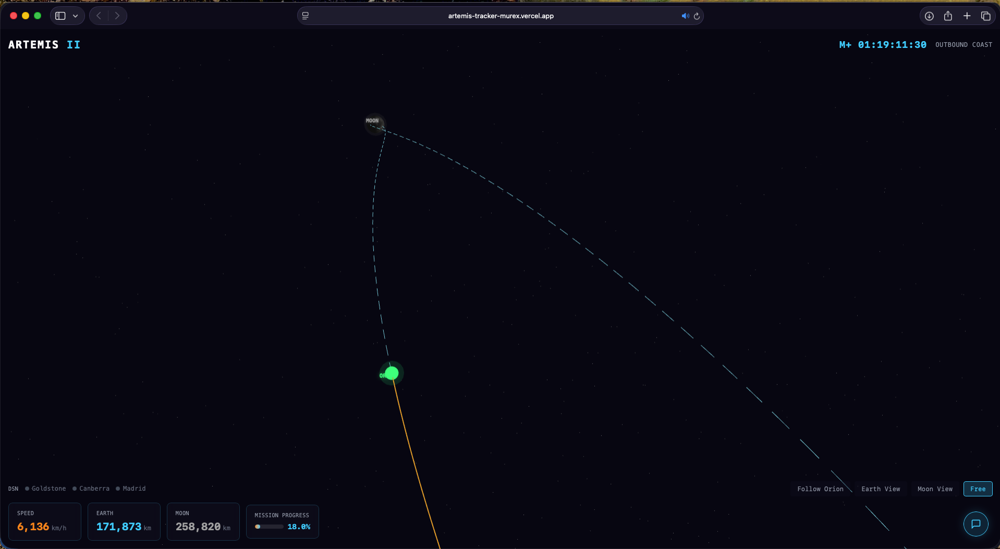
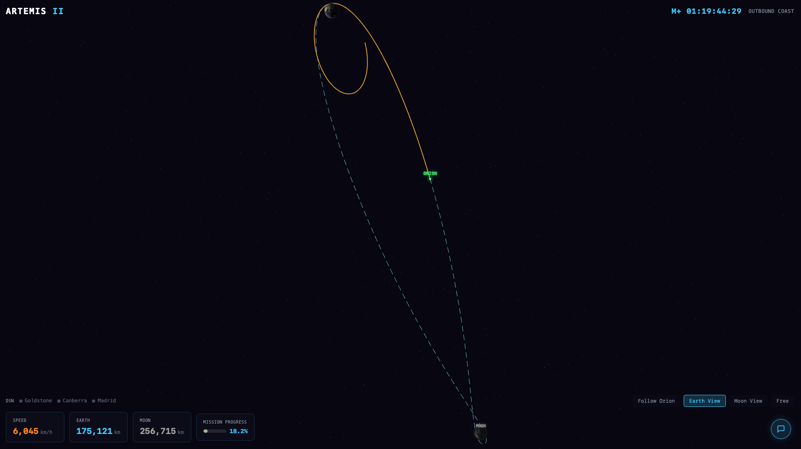
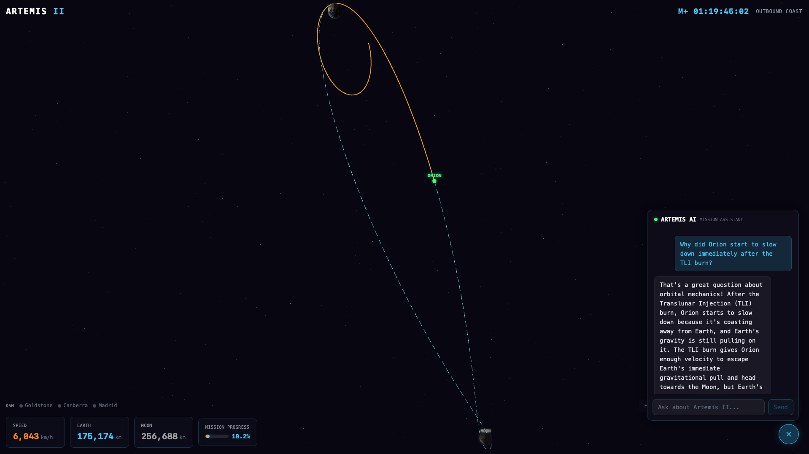
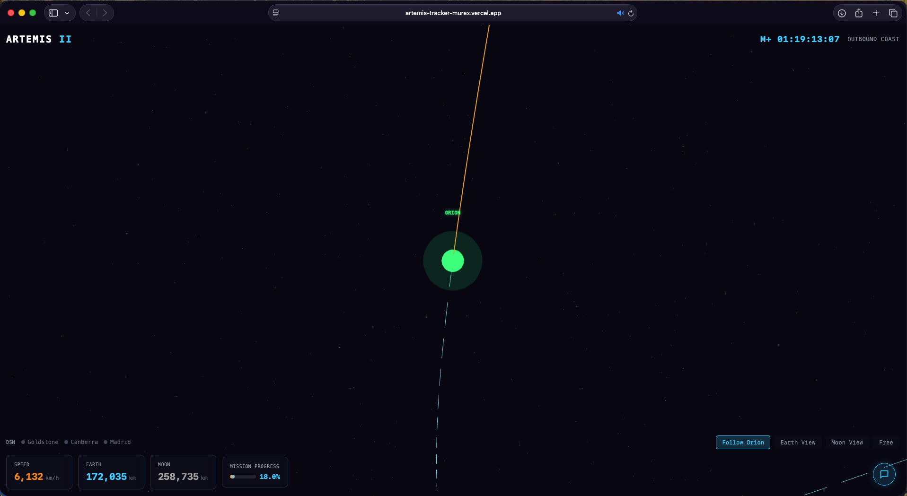
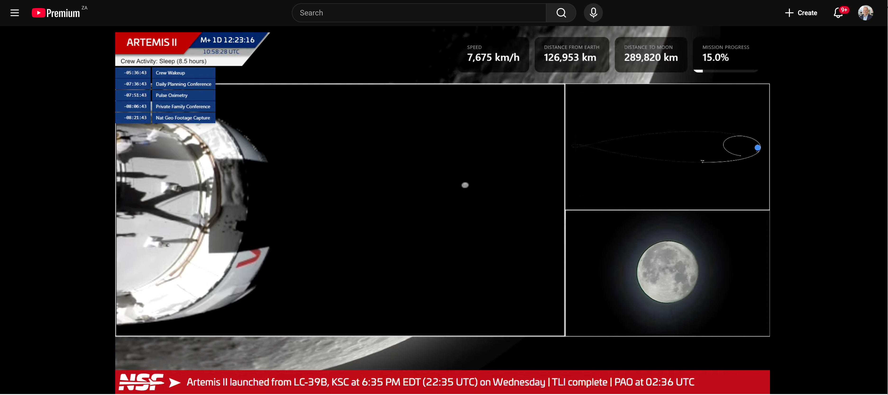

# ARTEMIS -- Artemis II Interactive Mission Tracker

A real-time, interactive 3D visualization of NASA's Artemis II lunar flyby mission, featuring live telemetry from NASA data feeds, an AI-powered mission chatbot, and Deep Space Network status -- all running in your browser.

**Live**: [artemis-tracker-murex.vercel.app](https://artemis-tracker-murex.vercel.app)
**Repo**: [github.com/fluxforgeai/ARTEMIS](https://github.com/fluxforgeai/ARTEMIS)

---

## What We Built

Artemis II launched on April 1, 2026 -- humanity's first crewed voyage beyond low Earth orbit since Apollo 17 in 1972. NASA does not provide a unified real-time telemetry API for the mission. Instead, spacecraft data is scattered across OEM ephemeris files, XML feeds, and on-demand ephemeris services.

ARTEMIS solves this by combining three NASA data sources into a single interactive 3D visualization: OEM trajectory files (parsed and interpolated with degree-8 Lagrange polynomials), the Deep Space Network's real-time XML feed, and JPL Horizons for lunar positioning. The result is an accurate, visually engaging mission tracker that anyone can explore in their browser.

The entire project -- from first line of code to production deployment -- was built in a single session using Claude Code with the [Wrought](https://wrought-web.vercel.app) structured engineering pipeline.

---

## Screenshots

### Plan View (Default)

The app opens with a top-down plan view computed from the trajectory's orbital plane, showing the full free-return path from Earth to the Moon and back.



### Earth View

Earth centered in the frame with Orion's trajectory arcing away toward the Moon. The orange line shows the path already traveled; the dashed cyan line shows the projected future trajectory.



### AI Mission Chatbot

Ask questions about the Artemis II mission. Common questions resolve instantly via quick-answer buttons (client-side, no API call). Free-text questions are answered by Google Gemini 2.5 Flash with a curated mission knowledge base.



### Follow Orion

Camera tracks the Orion spacecraft in real-time, showing its current position along the trajectory with Earth and Moon visible for context.



### Inspiration

The project was inspired by the NASASpaceflight YouTube mission overlay, with the goal of making something interactive, more accurate, and more engaging.



---

## Features

- **Interactive 3D Scene** -- Explore a real-time Earth-Moon-Orion scene built with React Three Fiber. Rotate, zoom, and pan freely, or use camera presets (Follow Orion, Earth View, Moon View, Free).
- **Live Trajectory Data** -- Spacecraft position and velocity interpolated from NASA OEM ephemeris files using degree-8 Lagrange interpolation with binary search (O(log n)) and zero per-frame allocations.
- **Telemetry HUD** -- Animated readouts for speed (km/h), distance from Earth (km), distance to Moon (km), mission elapsed time, and mission progress percentage. Numbers animate smoothly with spring physics.
- **AI Mission Chatbot** -- Ask anything about Artemis II. Powered by Google Gemini 2.5 Flash with a curated system prompt of mission facts. 12 quick-answer buttons resolve instantly without an API call. Supports multimodal responses: NASA images via NASA Image API, YouTube video embeds, and text with markdown formatting.
- **Space Weather Alerts** -- Synthetic radiation zone and Kp index alerts. AlertsBanner with auto-dismiss timers. Milestone approach notifications at configurable intervals.
- **Crew Timeline** -- Crew panel with 4 astronaut profiles. 19 mission milestones verified against OEM trajectory data with auto-scroll to current milestone.
- **Bloom/Glow Effects** -- Post-processing pipeline via `@react-three/postprocessing` with selective bloom on Orion, Earth atmosphere, and trajectory line.
- **Deep Space Network Status** -- Live indicators showing which DSN ground stations (Goldstone, Canberra, Madrid) are communicating with Orion.
- **Camera Presets** -- Four views: Follow Orion (tracks the spacecraft), Earth View (top-down plan view), Moon View (centered on the lunar flyby), and Free (user-controlled orbit).
- **Bundled Fallback Data** -- Includes a real 3,232-line OEM ephemeris file as a fallback, so the app loads instantly even if NASA's servers are slow.

## Tech Stack

| Layer | Technology | Purpose |
|---|---|---|
| Build | Vite 6.x | Dev server and bundler |
| UI Framework | React 19 | Component model |
| Language | TypeScript 5.x | Type safety |
| 3D Engine | Three.js r170+ | WebGL rendering |
| 3D React | @react-three/fiber 9.x | React-Three.js bridge |
| 3D Helpers | @react-three/drei 9.x | OrbitControls, Html overlays, textures |
| Animation | Framer Motion 12.x | HUD animated counters with spring physics |
| State | Zustand 5.x | Lightweight global state, frame-safe access |
| Styling | Tailwind CSS 4.x | Utility-first, CSS-only config (no tailwind.config) |
| AI Chatbot | Google Gemini 2.5 Flash | Mission Q&A via system prompt (free tier) |
| Hosting | Vercel | Static SPA + 5 serverless API proxies |

## Quick Start

```bash
# Clone
git clone https://github.com/fluxforgeai/ARTEMIS.git
cd ARTEMIS

# Install (legacy-peer-deps needed for R3F v9 / drei v9 compatibility)
npm install --legacy-peer-deps

# Configure API keys
cp .env.example .env
# Edit .env: add GEMINI_API_KEY and NASA_API_KEY

# Run locally
npm run dev
```

Open [http://localhost:5173](http://localhost:5173) in a WebGL2-capable browser.

### Deploy to Vercel

```bash
vercel deploy --prod
# Then set GEMINI_API_KEY and NASA_API_KEY in Vercel dashboard
```

## Data Sources

| Source | Endpoint | Data | Refresh |
|---|---|---|---|
| [AROW OEM](https://www.nasa.gov/missions/artemis/artemis-2/track-nasas-artemis-ii-mission-in-real-time/) | `/api/oem` | Spacecraft state vectors (J2000, 4-min intervals) | 5 min |
| [DSN Now](https://eyes.nasa.gov/apps/dsn-now/) | `/api/dsn` | Antenna status, signal strength, range | 30 sec |
| [JPL Horizons](https://ssd.jpl.nasa.gov/horizons/) | `/api/horizons` | Moon position (Earth-centered, J2000) | 30 min |
| [DONKI](https://api.nasa.gov/) | `/api/donki` | Solar flares, CMEs, radiation storms | 15 min |
| [Gemini Flash](https://ai.google.dev/) | `/api/chat` | AI chatbot responses | On demand |

## Architecture

```
Vercel Deployment
+-----------------------------------------------+
|  Serverless API (/api/)                       |
|  oem | dsn | horizons | donki | chat          |
+-----------------------------------------------+
|  Client SPA                                   |
|                                               |
|  3D Scene (React Three Fiber)                 |
|  Earth | Moon | Orion | Trajectory | Stars    |
|  DataDriver (frame-loop interpolation)        |
|  CameraController (presets + orbit controls)  |
|                                               |
|  HUD Overlay (React + Framer Motion)          |
|  Telemetry Cards | Clock | DSN | Progress     |
|                                               |
|  AI Chatbot (Gemini Flash)                    |
|  Quick answers (client) | Free text (API)     |
|                                               |
|  Data Layer (Zustand + Hooks)                 |
|  useOEM | useDSN | useMission | useChat       |
+-----------------------------------------------+
```

For full details see [ARCHITECTURE.md](ARCHITECTURE.md).

## Testing

```bash
npm run test      # 15 unit tests (OEM parser + Lagrange interpolator)
npm run build     # TypeScript type checking + production build
```

## How It Was Built

This project was built in a single session using [Claude Code](https://claude.ai/code) following the [Wrought](https://wrought-web.vercel.app) structured engineering pipeline:

1. `/finding` -- Identified the gap (no interactive Artemis II tracker)
2. `/research` -- Evaluated AI chatbot approaches (system prompt vs RAG)
3. `/design` -- Compared 4 architecture options, selected Vite + R3F
4. `/blueprint` -- Created detailed implementation spec (48 files, 8 phases)
5. `/wrought-implement` -- Autonomous implementation loop (completed in 1 iteration)
6. `/forge-review` -- Deep 4-agent code review (found 5 critical issues)
7. `/rca-bugfix` -- Root cause analysis and fix (all 5 resolved in 1 iteration)

All pipeline artifacts are preserved in the `docs/` directory.

## License

[MIT](LICENSE)

## Credits

**Data**: [NASA](https://www.nasa.gov/) (OEM, AROW, Blue Marble), [JPL](https://www.jpl.nasa.gov/) (Horizons, DSN Now), [ESA](https://www.esa.int/) (European Service Module)

**Built with**: [Three.js](https://threejs.org/), [React Three Fiber](https://r3f.docs.pmnd.rs/), [React](https://react.dev/), [Vite](https://vite.dev/), [Tailwind CSS](https://tailwindcss.com/), [Vercel](https://vercel.com/), [Google Gemini](https://ai.google.dev/)

---

*ARTEMIS is an independent community project. Not affiliated with or endorsed by NASA, JPL, or ESA. All NASA data and imagery are in the public domain.*
